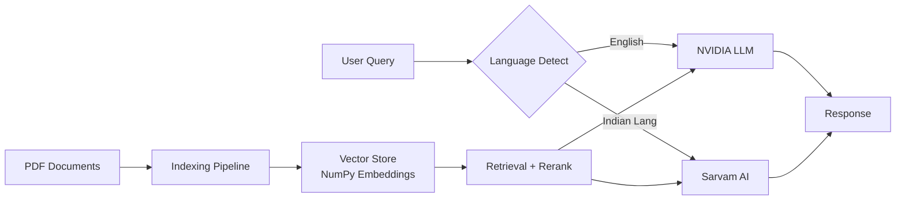
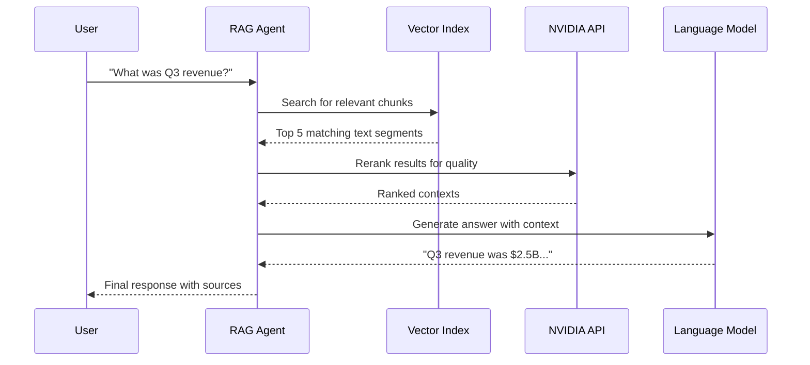

# 🚀 Enterprise RAG Agent

[](https://www.python.org/downloads/)
[](https://opensource.org/licenses/Apache-2.0)
[](https://www.docker.com/)

A **production-grade Retrieval-Augmented Generation (RAG)** system that enables intelligent conversations with your PDF documents. Powered by **NVIDIA AI** models and **Sarvam AI** for multilingual capabilities, this agent combines state-of-the-art embedding, vision, and reranking technologies.

---

## ✨ Key Features

| Feature | Description | Benefit |
|---------|-------------|---------|
| 🧠 **Advanced Embeddings** | NVIDIA `llama-3.2-nv-embedqa-1b-v2` | High-accuracy semantic search |
| 👁️ **Vision Intelligence** | `llama-3.2-90b-vision-instruct` | Extracts insights from charts, diagrams & images |
| 🎯 **Smart Reranking** | NVIDIA `nv-rerankqa-mistral-4b-v3` | Boosts retrieval precision by 15-25% |
| 🌍 **Multilingual** | Sarvam AI (`sarvam-30b`/`105b`) | Native support for 11+ Indian languages |
| ⚡ **Resilient Architecture** | Checkpointing, atomic saves, retry logic | Zero data loss, handles interruptions gracefully |
| 🔒 **Production Ready** | MD5 caching, health checks, Docker support | Enterprise-grade reliability & scalability |

---

## 🏗️ Architecture Overview



---

## 🚀 Quick Start

### Option 1: Docker (Recommended)

```bash
# Build and run
docker-compose up --build

# Or run directly
docker build -t rag-agent .
docker run --env-file .env -v $(pwd)/my_docs:/app/my_docs rag-agent
```

### Option 2: Local Installation

#### Prerequisites
- Python 3.11 or higher
- pip package manager
- Git

#### Step-by-Step Setup

1. **Clone the Repository**
   ```bash
   git clone <your-repo-url>
   cd LLM-RAG-MODEL
   ```

2. **Create Virtual Environment**
   ```bash
   python -m venv venv
   
   # Activate on Windows
   .\venv\Scripts\activate
   
   # Activate on macOS/Linux
   source venv/bin/activate
   ```

3. **Install Dependencies**
   ```bash
   pip install -r requirements.txt
   ```

4. **Configure Environment Variables**
   ```bash
   cp .env.example .env
   ```
   
   Edit `.env` with your API keys:
   ```env
   NVIDIA_API_KEY=nvapi-your-key-here
   SARVAM_API_KEY=your-sarvam-key  # Optional, for multilingual support
   ```

   > 💡 **Get API Keys:**
   > - NVIDIA: [build.nvidia.com](https://build.nvidia.com)
   > - Sarvam AI: [sarvam.ai](https://sarvam.ai)

---

## 📖 Usage Guide

### Preparation
Place your PDF documents in the `my_docs/` directory:
```bash
mkdir -p my_docs
cp /path/to/your/document.pdf my_docs/
```

### Interactive Chat Mode
Engage in multi-turn conversations with your documents:
```bash
python rag_agent.py
```

**Example Session:**
```
🤖 RAG Agent Ready! Type 'quit' to exit.

You: What are the key financial highlights?
🤖: Based on the documents, the key financial highlights include...

You: Can you elaborate on Q3 performance?
🤖: In Q3, the company reported...
```

### One-Shot Queries
Get instant answers without entering chat mode:
```bash
python rag_agent.py --query "What was the revenue growth in 2023?" --top-k 5
```

### Performance Optimization

| Mode | Command | Use Case |
|------|---------|----------|
| **Fast** | `--no-rerank --no-images` | Quick summaries, text-only docs |
| **Accurate** | `--rerank --images` (default) | Complex queries, visual content |
| **Multilingual** | `--model sarvam-30b` | Hindi, Tamil, Bengali, etc. |

### Output Management

Save results to different formats:
```bash
# JSON format
python rag_agent.py --query "Key findings" --output results.json

# Plain text
python rag_agent.py --query "Executive summary" --output summary.txt

# Append to existing log
python rag_agent.py --query "Update" --output history.jsonl --append
```

### Advanced Options

```bash
# Force reindex all documents (bypass cache)
python rag_agent.py --force-reindex

# Adjust chunk size for better context
python rag_agent.py --chunk-size 512 --overlap 50

# Limit processing time
python rag_agent.py --timeout 300 --max-docs 10

# Health check
python health_check.py
```

### Full CLI Reference

```bash
python rag_agent.py --help
```

| Argument | Default | Description |
|----------|---------|-------------|
| `--query` | None | Single query string |
| `--top-k` | 5 | Number of chunks to retrieve |
| `--chunk-size` | 256 | Token chunk size |
| `--overlap` | 50 | Chunk overlap tokens |
| `--no-rerank` | False | Disable reranking |
| `--no-images` | False | Skip image extraction |
| `--model` | llama-3.3-70b-instruct | LLM model selection |
| `--output` | None | Output file path |
| `--append` | False | Append to output file |
| `--force-reindex` | False | Rebuild index from scratch |
| `--verbose` | False | Enable debug logging |

---

## 🧪 Testing

Run the test suite to verify your installation:

```bash
# Run all tests
python -m pytest tests/ -v

# Run specific test module
python -m pytest tests/test_chunking.py -v

# With coverage
python -m pytest tests/ --cov=. --cov-report=html
```

**Test Coverage:**
- ✅ Chunking algorithms
- ✅ Embedding generation
- ✅ Retry logic & error handling
- ✅ Multilingual detection
- ✅ Cache invalidation

---

## 🐳 Docker Deployment

### Build Image
```bash
docker build -t rag-agent:latest .
```

### Run Container
```bash
docker run -d \
  --name rag-agent \
  --env-file .env \
  -v $(pwd)/my_docs:/app/my_docs \
  -v $(pwd)/cache:/app/cache \
  -p 8000:8000 \
  rag-agent:latest
```

### Docker Compose
```bash
docker-compose up -d
docker-compose logs -f
```

---

## 🏥 Health Monitoring

Verify system readiness:
```bash
python health_check.py
```

**Checks Performed:**
- ✅ Environment variables configured
- ✅ API connectivity (NVIDIA, Sarvam)
- ✅ PDF directory accessible
- ✅ Dependencies installed
- ✅ Cache directory writable

---

## 📁 Project Structure

```
LLM-RAG-MODEL/
├── rag_agent.py          # Main CLI application
├── sarvam_rag.py         # Sarvam AI integration
├── health_check.py       # System health verification
├── requirements.txt      # Python dependencies
├── .env.example          # Environment template
├── Dockerfile            # Container configuration
├── docker-compose.yml    # Multi-container setup
├── my_docs/              # PDF documents directory
├── cache/                # Auto-generated embeddings cache
└── tests/                # Test suite
    ├── test_chunking.py
    ├── test_embeddings.py
    └── test_retry_logic.py
```

---

## 🔧 Troubleshooting

### Common Issues

**Issue: API Rate Limits**
```bash
# Solution: Implement backoff (already built-in) or reduce concurrency
python rag_agent.py --query "..." --timeout 600
```

**Issue: Outdated Cache**
```bash
# Solution: Force reindex
python rag_agent.py --force-reindex
```

**Issue: Memory Errors with Large PDFs**
```bash
# Solution: Reduce chunk size and limit documents
python rag_agent.py --chunk-size 128 --max-docs 5
```

**Issue: Multilingual Not Working**
```bash
# Verify SARVAM_API_KEY is set
python health_check.py
```

### Getting Help

1. Check logs: `tail -f cache/logs/*.log`
2. Run health check: `python health_check.py`
3. Review documentation: `python rag_agent.py --help`

---

## 📊 Performance Benchmarks

| Metric | Value | Conditions |
|--------|-------|------------|
| Embedding Speed | ~500 docs/hour | Standard PDFs, batch mode |
| Query Latency | <2s | With reranking, top-k=5 |
| Cache Hit Ratio | >90% | Subsequent queries |
| Memory Usage | ~500MB | Typical workload |

---

## 🧠 Understanding RAG: How It Works

### What is Retrieval-Augmented Generation?

**RAG (Retrieval-Augmented Generation)** is an AI framework that combines two powerful capabilities:

1. **Retrieval**: Finding relevant information from your documents
2. **Generation**: Creating natural language responses using that information

```
┌─────────────┐     ┌──────────────┐     ┌─────────────┐
│   Your      │     │   RAG       │     │    AI       │
│  Question   │ ──► │   System    │ ──► │  Response   │
│             │     │   Search    │     │             │
└─────────────┘     └──────────────┘     └─────────────┘
                           │
                           ▼
                    ┌──────────────┐
                    │  Your PDFs   │
                    │  (Knowledge) │
                    └──────────────┘
```

### Why RAG Instead of Just Asking the AI?

| Approach | Problem | RAG Solution |
|----------|---------|--------------|
| **Standard LLM** | May hallucinate facts | ✅ Grounded in your actual documents |
| **Standard LLM** | No access to your private data | ✅ Works with your confidential PDFs |
| **Standard LLM** | Knowledge cutoff (outdated) | ✅ Always uses latest documents |
| **Search Only** | Returns links, not answers | ✅ Generates human-readable responses |

### Step-by-Step Data Flow



#### Phase 1: Indexing (One-Time Setup)

1. **Document Loading**: PDFs are read from `my_docs/` folder
2. **Text Extraction**: Text and images extracted using PyMuPDF
3. **Chunking**: Text split into overlapping segments (256 tokens, 50 overlap)
4. **Embedding**: Each chunk converted to 1024-dimensional vector via NVIDIA
5. **Storage**: Vectors saved in NumPy arrays with metadata cache

#### Phase 2: Query Processing (Every Question)

1. **Question Embedding**: User query converted to vector
2. **Similarity Search**: Find closest document chunks (cosine similarity)
3. **Reranking**: Re-score top results for better relevance
4. **Context Assembly**: Combine retrieved chunks with question
5. **LLM Generation**: Model generates answer grounded in retrieved context
6. **Response Delivery**: Answer shown to user with source citations

---

## 🌍 Real-World Use Cases

### Enterprise Scenarios

| Industry | Use Case | Example Query |
|----------|----------|---------------|
| 📊 **Finance** | Analyze quarterly reports | "Compare profit margins across Q1-Q4" |
| ⚖️ **Legal** | Contract review & compliance | "What are the termination clauses?" |
| 🏥 **Healthcare** | Medical research papers | "Summarize findings on treatment X" |
| 🎓 **Education** | Academic paper analysis | "Explain the methodology used in this study" |
| 🏭 **Manufacturing** | Technical documentation | "How do I troubleshoot error code E-452?" |
| 👥 **HR** | Employee handbook queries | "What's the policy on remote work?" |
| 🔬 **Research** | Scientific literature review | "What compounds showed efficacy in trial?" |

### Personal Productivity

- 📚 **Students**: Upload lecture notes and textbooks for exam prep
- 📰 **Researchers**: Process academic papers for literature reviews
- 📑 **Consultants**: Analyze client documents for insights
- 🏛️ **Lawyers**: Review case files and precedents quickly
- 💼 **Executives**: Get summaries of lengthy reports

---

## ❓ Frequently Asked Questions (FAQ)

### General Questions

**Q: Do I need GPU to run this?**  
A: No! All heavy computation happens on NVIDIA's cloud APIs. Your local machine only handles orchestration.

**Q: Can this work offline?**  
A: No, internet connection is required for NVIDIA and Sarvam API calls. However, once indexed, you don't need to reprocess PDFs.

**Q: How many PDFs can I process?**  
A: Practically unlimited. The system processes documents incrementally and caches results. Large libraries may take longer initially but subsequent queries remain fast.

**Q: Does it support languages other than English?**  
A: Yes! With Sarvam AI integration, you get native support for 11+ Indian languages including Hindi, Tamil, Bengali, Telugu, Marathi, Gujarati, Kannada, Malayalam, Punjabi, Assamese, and Odia.

### Technical Questions

**Q: What happens if the API is down?**  
A: The system implements exponential backoff retry logic (up to 3 attempts). If all retries fail, you'll get a clear error message and can resume later.

**Q: How is my data protected?**  
A: Your PDFs never leave your machine. Only text chunks are sent to NVIDIA APIs for embedding/reranking, and these are not stored by NVIDIA. See [NVIDIA's privacy policy](https://www.nvidia.com/en-us/about-nvidia/privacy-policy/) for details.

**Q: Can I use my own embedding model?**  
A: Currently optimized for NVIDIA's `llama-3.2-nv-embedqa-1b-v2`. Custom model support is planned for future releases.

**Q: How do I update documents after indexing?**  
A: Simply add new PDFs to `my_docs/` and run normally. Changed files are detected via MD5 hash and reindexed automatically. Use `--force-reindex` to rebuild everything.

### Cost & Performance

**Q: Is there a free tier?**  
A: NVIDIA offers free credits for new users. Check [build.nvidia.com](https://build.nvidia.com) for current pricing and free tier availability.

**Q: How much does it cost to run?**  
A: Typical usage costs:
- Embedding: ~$0.01 per 100 pages
- Query: ~$0.001 per question (with reranking)
- Monthly average for moderate use: $5-20

**Q: Why is the first query slow?**  
A: Initial indexing happens on first run. Subsequent queries leverage cached embeddings and are much faster (<2 seconds typically).

---

## 📖 Glossary of Terms

| Term | Definition |
|------|------------|
| **Chunk** | A small segment of text (typically 256 tokens) extracted from a document |
| **Embedding** | Numerical vector representation of text that captures semantic meaning |
| **Vector Store** | Database optimized for storing and searching embedding vectors |
| **Cosine Similarity** | Mathematical measure of similarity between two vectors (range: -1 to 1) |
| **Reranking** | Second-pass scoring of retrieved results to improve relevance |
| **Token** | Basic unit of text for LLMs (roughly ¾ of a word) |
| **Context Window** | Maximum amount of text an LLM can process in one request |
| **Hallucination** | When an AI generates false or fabricated information |
| **Semantic Search** | Finding content based on meaning rather than keyword matching |
| **Multi-turn** | Conversation with multiple back-and-forth exchanges maintaining context |
| **Checkpoint** | Saved state allowing interrupted processes to resume |
| **Atomic Save** | File operation that prevents corruption by writing to temp file first |

---

## 🤝 Contributing

We welcome contributions! Please follow these steps:

1. Fork the repository
2. Create a feature branch (`git checkout -b feature/amazing-feature`)
3. Commit changes (`git commit -m 'Add amazing feature'`)
4. Push to branch (`git push origin feature/amazing-feature`)
5. Open a Pull Request

**Development Setup:**
```bash
pip install -r requirements.txt
pip install pytest pytest-cov black flake8
```

---

## 📄 License

This project is licensed under the **Apache License 2.0** - see the [LICENSE](LICENSE) file for details.

**What this means for you:**
- ✅ Free to use for commercial and personal projects
- ✅ Can modify and distribute the code
- ✅ Can use patents granted by contributors
- ✅ Must include copyright notice and license text
- ✅ Must state changes made to the code
- ❌ Cannot use trademarks without permission
- ❌ No warranty provided (AS IS basis)

---

## 🙏 Acknowledgments

- **NVIDIA** for providing state-of-the-art AI models via NIM API
- **Sarvam AI** for exceptional multilingual capabilities
- **LangChain** community for inspiration and best practices

---

## 📬 Contact & Support

- **Documentation**: Full API docs available in code docstrings
- **Issues**: Report bugs via GitHub Issues
- **Discussions**: Feature requests and questions welcome

---

<div align="center">

**Built with ❤️ using NVIDIA AI & Sarvam AI**

[⬆ Back to Top](#-enterprise-rag-agent)

</div>
