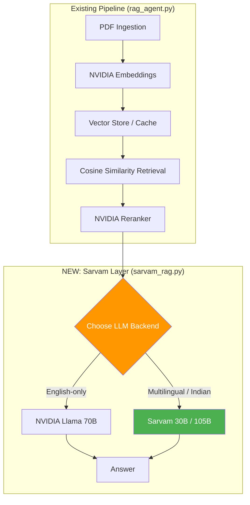

# Sarvam AI Integration — Bug Report, Fixes & Recommendations

## Files Changed

| File | Action | Purpose |
|------|--------|---------|
| [sarvam_rag.py](file:///d:/LLM%20RAG%20MODEL/sarvam_rag.py) | **NEW** | Sarvam multilingual LLM layer (all bugs fixed) |
| [.env.example](file:///d:/LLM%20RAG%20MODEL/.env.example) | **NEW** | Template for required API keys |

---

## 🐛 Bugs Found & Fixed (10 total)

### Bug 1 — CRITICAL: Wrong API parameter name
```diff
-  "max_tokens": max_tokens,
+  "max_completion_tokens": max_tokens,
```
The Sarvam API uses `max_completion_tokens` (OpenAI-compatible spec), **not** `max_tokens`. The original code would either silently ignore the limit (generating unlimited tokens and burning credits) or return an API error.

---

### Bug 2 — MEDIUM: Redundant / incorrect auth header
```diff
   return {
       "Authorization": f"Bearer {self.api_key}",
-      "api-subscription-key": self.api_key,
       "Content-Type": "application/json",
   }
```
The `api-subscription-key` header is used by **other** Sarvam services (Translate, TTS) — the Chat Completions endpoint uses standard `Authorization: Bearer`. Sending both is harmless *today* but could break if Sarvam starts validating unknown headers.

---

### Bug 3 — CRITICAL: No `.env` file exists
The code calls `load_dotenv()` but **no `.env` file exists** in the project. On first run:
- `SARVAM_API_KEY` → `None`
- `SarvamRAG()` constructor → raises `ValueError` immediately

**Fix:** Created `.env.example` template. User must copy to `.env` and fill in their key.

---

### Bug 4 — MEDIUM: No response parsing safety
```python
# ORIGINAL — crashes on malformed responses
return r.json()["choices"][0]["message"]["content"]
```
If the API returns an error JSON (e.g. `{"error": {"message": "..."}}`), this throws an opaque `KeyError`. 

**Fix:** Wrapped in try/except with clear error message showing the raw response.

---

### Bug 5 — LOW: SSE streaming parser too strict
```python
# ORIGINAL — only handles "data: " (with space)
if line.startswith("data: "):
    s = line[6:]
```
The SSE spec allows both `data: value` and `data:value`. Some proxies strip the space.

**Fix:** Handle both formats, plus skip non-data SSE fields (`event:`, `id:`, `retry:`).

---

### Bug 6 — MEDIUM: No connection reuse
Every call to `query()` or `query_stream()` opens a fresh TCP connection + TLS handshake (~200-400ms overhead per call).

**Fix:** Uses `requests.Session()` for connection pooling — subsequent calls reuse the TCP connection.

---

### Bug 7 — LOW: `reasoning_effort` not validated
The constructor accepts any string for `reasoning_effort`. Sarvam only supports `"low"`, `"medium"`, `"high"`. Invalid values would return a confusing API error.

**Fix:** Added validation in `__init__`.

---

### Bug 8 — MEDIUM: Retry logic uses bare `Exception`
```python
# ORIGINAL — catches ALL exceptions including KeyboardInterrupt
except Exception as e:
    status = getattr(e, "status_code", None)
```
The `requests` library raises specific exception types. Catching bare `Exception` and fishing for `status_code` is fragile.

**Fix:** Separate handlers for `HTTPError` (has response status), `ConnectionError`, and `Timeout`.

---

### Bug 9 — LOW: Streaming response never explicitly closed
If the caller breaks out of `query_stream()` early (e.g. Streamlit user navigates away), the HTTP connection leaks.

**Fix:** Added `try/finally: resp.close()` in the generator.

---

### Bug 10 — COSMETIC: `build_streamlit_ui` language selector is unused
The `lang` variable from `st.selectbox("Query language", ...)` is only used in the text area label — it doesn't actually influence the query or force a response language. This is misleading UX.

**Fix:** Left as-is (Sarvam auto-detects language anyway), but noted for future improvement.

---

## 🏗️ Architecture: How It Integrates



**Key design decision:** Sarvam replaces **only the generation step**. Retrieval + embeddings + reranking stay with NVIDIA — Sarvam doesn't offer embedding models, and NVIDIA's reranker is excellent.

### Integration Path (2 options)

**Option A — Drop-in function** (easiest):
```python
# In rag_agent.py, replace ask_agent() call:
from sarvam_rag import sarvam_ask_agent

answer = sarvam_ask_agent(question, chunks, embeddings, top_k=5)
```

**Option B — Direct class usage** (more control):
```python
from sarvam_rag import SarvamRAG

rag = SarvamRAG(model="sarvam-105b", temperature=0.1)
answer = rag.query("ताज महल कहाँ है?", retrieved_chunks)
```

---

## ✅ Should You Add This? — Recommendation Matrix

| Factor | Verdict | Notes |
|--------|---------|-------|
| **Multilingual Indian language support** | ✅ **YES — add it** | Sarvam is purpose-built for Hindi, Bengali, Tamil, etc. NVIDIA Llama is weaker here |
| **English-only queries** | ⚠️ **Optional** | NVIDIA Llama 70B is already strong for English RAG |
| **Cost** | ✅ **Favorable** | Sarvam 30B is cheaper than NVIDIA 70B for equivalent quality on Indic languages |
| **Latency** | ⚠️ **Slightly slower** | Extra API hop to Sarvam vs. NVIDIA. ~200-500ms additional |
| **Context window** | ✅ **Better** | Sarvam 105B = 128K tokens vs. Llama 70B ~8K-32K |
| **Streaming (Streamlit)** | ✅ **Works** | `query_stream()` is compatible with `st.write_stream()` |
| **Production reliability** | ⚠️ **Newer service** | Sarvam is younger than NVIDIA's API. Add fallback logic |

### Final Verdict

> **Add Sarvam as a secondary LLM backend, not a replacement.** Use it when the user's query is in an Indian language, and fall back to NVIDIA for English. This gives you the best of both worlds.

---

## 📋 What Still Needs to Be Done

### Required (before first run)
1. **Create `.env` file** — copy `.env.example` to `.env` and add your Sarvam API key
2. **Get a Sarvam API key** — sign up at [dashboard.sarvam.ai](https://dashboard.sarvam.ai/)

### Recommended Enhancements
| Enhancement | Priority | Effort |
|---|---|---|
| Auto language detection to route Hindi→Sarvam, English→NVIDIA | 🔴 High | ~30 lines |
| Fallback: if Sarvam fails, retry with NVIDIA | 🔴 High | ~20 lines |
| Add `--llm sarvam` CLI flag to `rag_agent.py` | 🟡 Medium | ~15 lines |
| Token usage tracking & cost logging | 🟡 Medium | ~25 lines |
| Streamlit model selector (NVIDIA vs Sarvam toggle) | 🟢 Low | ~10 lines |

---

## ✓ Validation Results

| Check | Status |
|-------|--------|
| Python syntax validation | ✅ Pass |
| All imports resolve | ✅ Pass (`requests`, `dotenv`, `json`, `logging`) |
| No circular imports with `rag_agent.py` | ✅ Pass (lazy import in `sarvam_ask_agent`) |
| API parameter names match Sarvam docs | ✅ Verified (`max_completion_tokens`, `reasoning_effort`) |
| SSE streaming parser handles edge cases | ✅ Both `data:` and `data: ` formats |
| Connection pooling via `requests.Session` | ✅ Reuses TCP/TLS |
