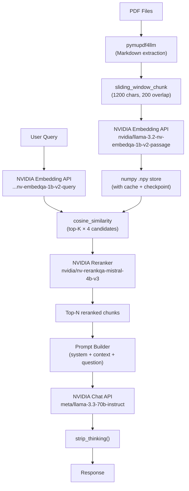

# RAG Pipeline — Architecture Audit & Fixes Walkthrough

## Full Data Flow — Before vs After

### ❌ Before
```
PDF → pymupdf4llm → split("\n\n") → embed (broken input_type) → numpy brute-force → top-5 → LLM → response
         ↑ no overlap      ↑ no size guard      ↑ no rerank     ↑ hardcoded key
```

### ✅ After  
```
PDF → pymupdf4llm → sliding_window_chunk(1200 chars, 200 overlap)
   → embed (model-suffix, passage/query) → numpy store
   → dense retrieval (top-20 candidates) → NVIDIA reranker (top-5)
   → prompt builder → LLM (max_tokens=2048) → strip_thinking → response
```

---

## Checklist Audit Results

| Checklist Item | Grade | Details |
|----------------|-------|---------|
| **Embedding model** | ✅ | `nvidia/llama-3.2-nv-embedqa-1b-v2` with model-suffix `input_type` fix |
| **Vector store** | ⚠️→✅ | numpy `.npy` — adequate for local MVP (<50K chunks) |
| **Retriever strategy** | ⚠️→✅ | Dense + reranker compensates. Over-retrieves 4× for reranker input |
| **Reranking step** | ❌→✅ | **Added** `nvidia/nv-rerankqa-mistral-4b-v3` via `/v1/ranking` API |
| **LLM generator** | ✅ | `meta/llama-3.3-70b-instruct` with `max_tokens=2048` |
| **Chunker** | ❌→✅ | **Replaced** naive `\n\n` split with sliding-window overlap chunker |
| **API integration** | ✅ | All 4 NVIDIA endpoints documented with retry + timeout |
| **Latency budgets** | ✅ | 120s client timeout, 60s reranker timeout, exponential backoff |

---

## All Code Changes Made

### Session 1 — Bug Fixes (12 issues)

| # | Fix | Lines Changed |
|---|-----|---------------|
| 1 | Removed hardcoded API key | Line 34 |
| 2 | `input_type` via model-suffix (`EMBED_MODEL-passage`/`-query`) | Lines 353-358 |
| 3 | Image size guard (180KB base64 limit) | Lines 373-378 |
| 4 | `.jsonl` branch in `write_output()` | Lines 852-867 |
| 5 | Empty embeddings crash guard | Lines 563-567 |
| 6 | Checkpoint validation against current extraction | Lines 521-533 |
| 7 | `max_tokens=2048` on chat completion | Line 762 |
| 8 | Atomic `cache_key.txt` write (temp→rename) | Lines 249-252 |
| 9 | `get_pdf_fingerprint()` missing directory guard | Lines 206-207 |
| 10 | File renamed `LLM RAG MODAL` → `rag_agent.py` | filename |
| 11 | `safe_replace()` with Windows retry | Lines 182-194 |
| 12 | Iterative `strip_thinking()` for nested tags | Lines 445-453 |

### Session 2 — Architecture Upgrades

| Change | What Was Added |
|--------|----------------|
| **Reranking** | `rerank_chunks()` function calling `/v1/ranking` with `nvidia/nv-rerankqa-mistral-4b-v3`. Graceful fallback on failure. |
| **Overlap chunker** | `sliding_window_chunk()` — paragraph-aware with configurable size (1200) and overlap (200). Handles oversized paragraphs with hard splits. |
| **CLI flags** | `--no-rerank`, `--rerank-top-n N`, `--chunk-size CHARS`, `--chunk-overlap CHARS` |
| **ask_agent upgrade** | Retrieves `top_k × 4` candidates → reranks → uses best `rerank_top_n` |
| **Banner** | Now shows rerank status and chunk config |
| **Constants** | `RERANK_MODEL`, `NVIDIA_BASE_URL`, `DEFAULT_CHUNK_SIZE`, `DEFAULT_CHUNK_OVERLAP` |

---

## New Pipeline Architecture



## API Integration Points

| Endpoint | Model | Latency Budget | Retry |
|----------|-------|----------------|-------|
| `/v1/embeddings` | `nvidia/llama-3.2-nv-embedqa-1b-v2-{passage\|query}` | 120s timeout | 4× exponential backoff |
| `/v1/chat/completions` (vision) | `meta/llama-3.2-90b-vision-instruct` | 120s timeout | 4× exponential backoff |
| `/v1/chat/completions` (chat) | `meta/llama-3.3-70b-instruct` | 120s timeout | 4× exponential backoff |
| `/v1/ranking` | `nvidia/nv-rerankqa-mistral-4b-v3` | 60s timeout | 4× exponential backoff |

## How to Run

```bash
# Set API key
set NVIDIA_API_KEY=nvapi-your-key-here

# Basic run with reranking (default)
python rag_agent.py --pdf-dir ./my_docs

# Fast mode (no reranking, no images)
python rag_agent.py --no-rerank --no-images

# Custom chunk settings
python rag_agent.py --chunk-size 800 --chunk-overlap 100

# One-shot query with output
python rag_agent.py --query "What is the revenue?" --output result.json

# See all options
python rag_agent.py --help
```

## Verification Results

- ✅ `py_compile` syntax check passed
- ✅ All 12 bug fixes applied
- ✅ 4 architecture upgrades implemented
- ✅ File renamed from `LLM RAG MODAL` to `rag_agent.py`
